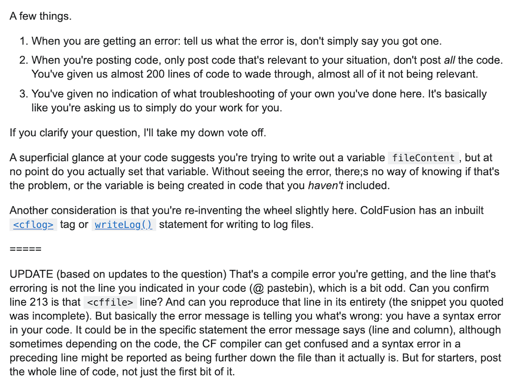
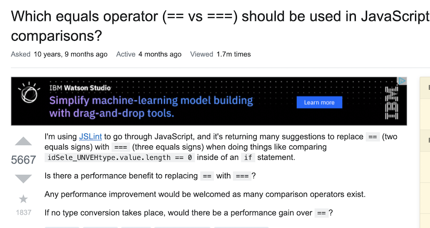

Despite what the phrase “there are no stupid questions” may lead you to believe, there are definitely stupid questions. When I say, there are stupid questions, I mean that there are questions that can be so poorly worded that they come off as either lazy or confusing and people don’t like being asked lazy and confusing questions. 

## The Consequences of Bad Questions 
Take for example this question that comes from: 
  <a href = "https://stackoverflow.com/questions/13946934/create-contain-file-log-coldfusion"> create contain file log coldfusion </a>

The original question posed is extremely confusing and seems hastily posted. The person asking the question states that they want their code to create a log file but an error occurs. They then post a link to their code, and then they say to look at a specific line of code that's there for unknown reasons. The original poster does not have what programming languages or tools they are using for this code. They at first didn't have what error was occuring for them, and then they posted the error and a line of code, which they said was where the error was occuring. However, as pointed out by a respondent, the line of code that the original poster said is causing the error is a different line of code then where the error message states the error is occuring. The original poster also does not state anything they did attempted to fix their code and just asks for help. Since the question is not currently marked as solved, I assume the original poster never found an answer to their question. This may be because their question is ambigious and indescriptive, which is confusing and hard for people to solve. 

## The Rewards of Good Questions
To see a question that was asked in a clear and “smart” manner take this question from: 
  <a href = "https://stackoverflow.com/questions/359494/which-equals-operator-vs-should-be-used-in-javascript-comparisons/359509#359509"> Which equals operator (== vs ===) should be used in JavaScript comparisons? </a>

The question begins with some background information about how, while coding in JavaScript the poster was prompted to change their comparison operator == to ===. The poster follows this with a simple example of code that was prompted to be changed and then asks if there is a benefit to replacing == with ===. Unlike the previous question, this question gives relevant background information that gives context to the question, gives a quick example and then asks their question instead of just asking for help. Due to their question being articulately asked, the original poster was rewarded with multiple detailed responses to their question about the differences between the == and === comparison operators in JavaScript. 

## You Reap What You Sow
I personally know what it's like to ask a bad question and be called out about it. It was done by a TA about a question I emailed him concerning a homework assignment. The response was quite polite, but I still felt quite embarrased by how poorly I had written my question. I sent him a copy of my entire code and simply put that an error occurs and I don't know why. The TA was kind enough to politely tell me that I should put what error I was getting, what I had already tried up to that point and to only send him code relevant to the error. After checking the error I was getting and going through the part of my code that was causing the error, I found that I had made an easy to fix logic error in my code. This unfortunate exchange showed me that being able to communicate as a programmer is just as important as being able to code, and that the moreeffort you put into asking a question, the more effort others will put into answering it. 
