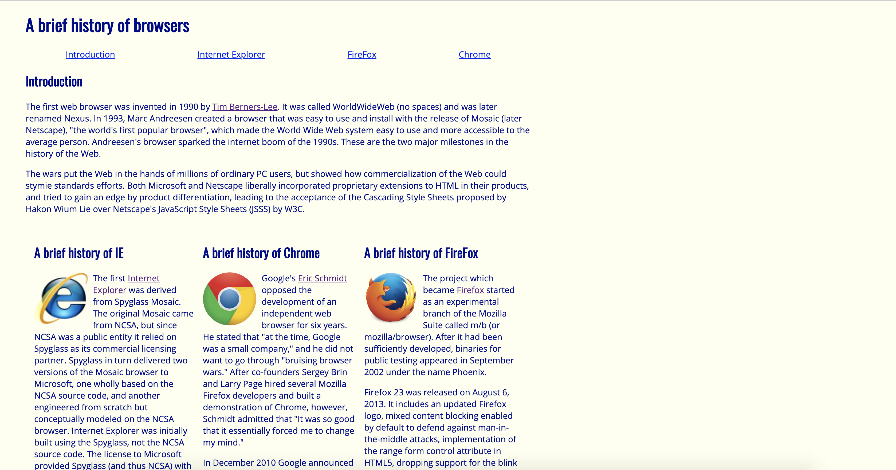
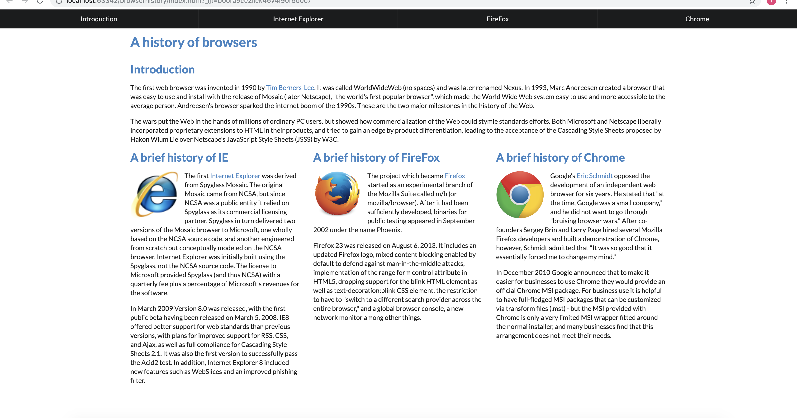

## My Rookie Experience 
My introduction to HTML and CSS was on Free Code Camp where I was attempting to learn about web development on my own. The first few exercises involved using HTML to create a page about cats, and I remembered feeling underwhelmed. The page seemed so simple for the time and code it took to create, and I thought how do you turn such a simple page into a professional and stylish website? 

## HTML vs Semantic UI
My first project using Semantic UI was a remake of another project, Browser History, that was built earlier using raw HTML and CSS. The first thing that got my attention after remaking Browser History with Semantic UI was how simple it was to create the webpage and how neat and clean the webpage looked. For the Browser History project, we had to create a navigation bar. To create the navigation bar using raw HTML and CSS, I used an unordered list with a few CSS style rules that looked like this: 

However, when I created the navigation bar using Semantic UI, all I had to do was create a single div for the navigation bar. This was easier to create and looked much better than the original: 

## Why Use a Framework? 
Some people seem to dislike Semantic UI for one reason or another. However, in my experiences thus far, Semantic UI has been a great way to make creating web pages simpler and easier, at least for me. Some of the problems I have with Semantic UI are sometimes my CSS styles are overridden by the Semantic UI styles and changing the layout of web pages to be exactly how I want it occasionally takes some creative coding. Despite this, the amount of time I save using Semantic UI instead of raw HTML and CSS makes it completely worth any problems or issues I might face. 
