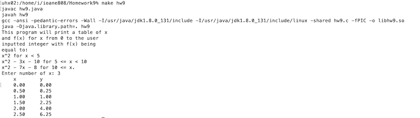

In this homework for ICS 211 we were given a function f(x) = x^2 for x < 5, x^2 - 3x - 10 for 5 <= x < 10 and x^2 - 7x - 8 for 10 <= x. We were tasked with getting an user inputted integer and printing out a table of x and f(x) values that would start at x = 0 and increment by 0.5 until the table reached the user inputted integer. The user interface code and code to print the values of x and f(x) as a table were done in Java. While the code to find the f(x) values based on the user inputted integer was done in C. The main point of the project was to use Java Native Interface to compile and execute code that is in both Java and C or C++.

Here is a sample of the code's output and how I compiled and executed the code: 

The two hardest parts about this assignment were trying to switch between writing Java and C code and getting everything to compile and execute. Trying to debug and switch between Java and C while coding was a challenge as I had never worked on multiple languages at the same time before but it’s something I found valuable to be able to switch from one language to another. Getting the files to compile together was also the biggest challenge as I was having trouble including a path for the code to run.

