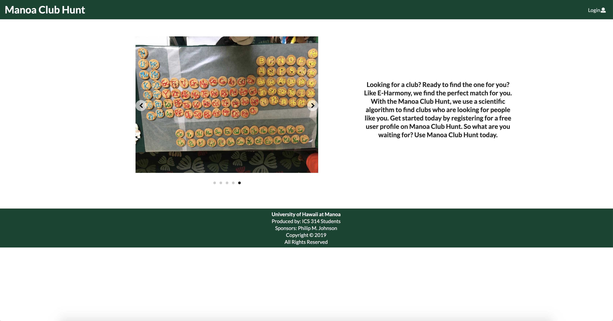

Manoa Club Hunt is a web application made to help University of Hawaiʻi at Mānoa students find college clubs to join.
This web application was developed as the final project for my ICS 314 class alongside my classmates Konapiliahi Canaday, Xandrew Julian and Sun Young Kim. 
Manoa Club Hunt allowed users to create their own profile, browse the different clubs registered with the University of Hawaiʻi at Mānoa, see a club's profile and add new clubs to our database. 
 
 I worked mostly with the user profile side of the application.
 I created the user profile and the edit user profile pages. 
 I feel like this project was the most important one of my ICS career to date. 
 This project gave me the first real group work experience I have ever had in ICS.
 Because of this project I had to learn how to make my code fit with the code of other developers and how to take what I have learned in my ICS classes to create my own project.
  

Here is the GitHub page for our project: 
 
<a href="https://manoa-club-hunt.github.io/">Manoa Club Hunt GitHub Page</a>
 
The GitHub page includes an overview of our project, user feedback, screenshots of our application's pages.

Here is a link to our application's homepage as well: 
 
<a href="http://manoa-club-hunt.meteorapp.com/#/">Manoa Club Hunt</a>
